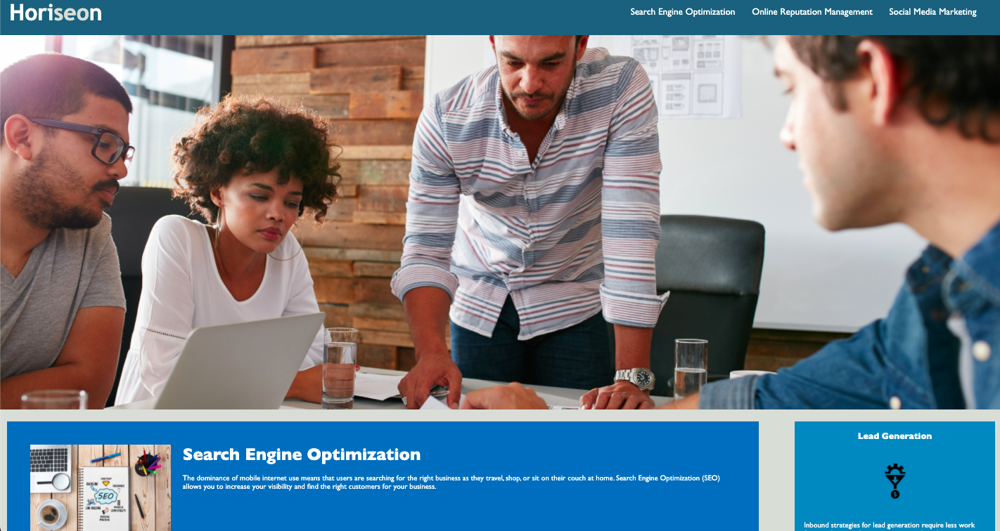

## IMPROVING ACCESSIBILITY

Improving SEO for the Horiseon Company by improving the accessibility of the site. Using semantic tags and the alt attribute to make the site more accessible for people with diabilities. 

Improving the accessibility of the site will increase SEO Rankning of the site. Having a better SEO Ranking will increase the traffic visiting the site and while also increasing the customer base by widening the people who can read and use the site.

Lastly consolidated and organized CSS to be more readable and functional 

## Installation 

You can Fork this Repository to Deploy this on your server. 

1. Be logged into Github
2. In the top-right corner of this page, click Fork

## Usage

This file is used to show you how improved accessibility while keeping the site very similar. Below is a screen of our website.

## Credits

[the VSCode repository](https://github.com/microsoft/vscode)

[Mastering Markdown](https://guides.github.com/features/mastering-markdown/).

[Git Hub Forking](https://docs.github.com/en/free-pro-team@latest/github/getting-started-with-github/fork-a-repo)
